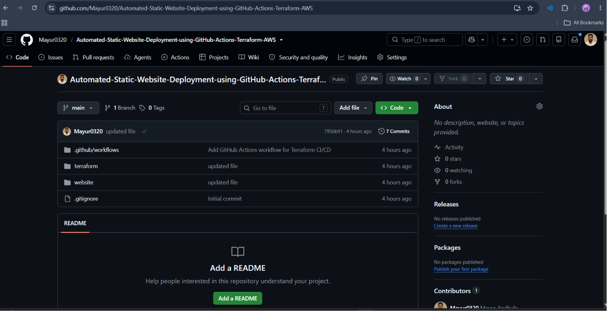
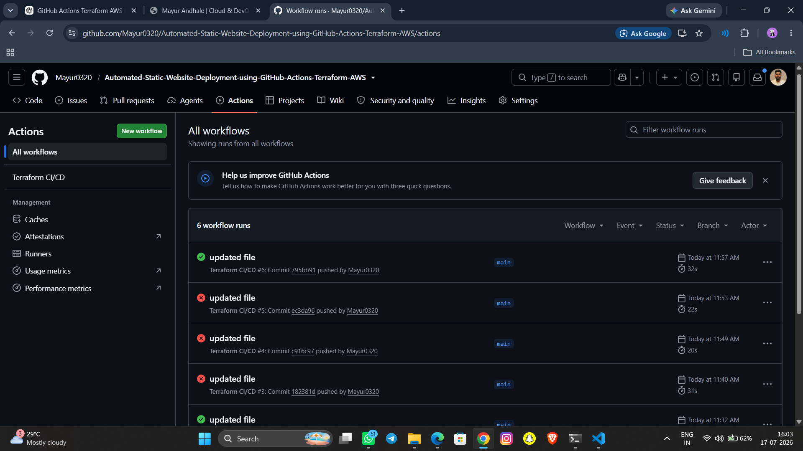
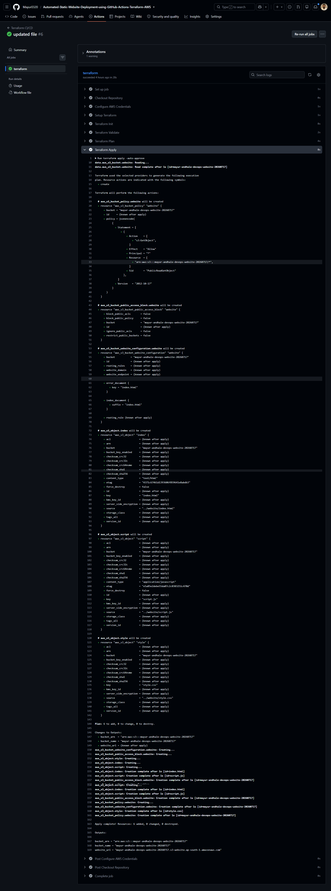
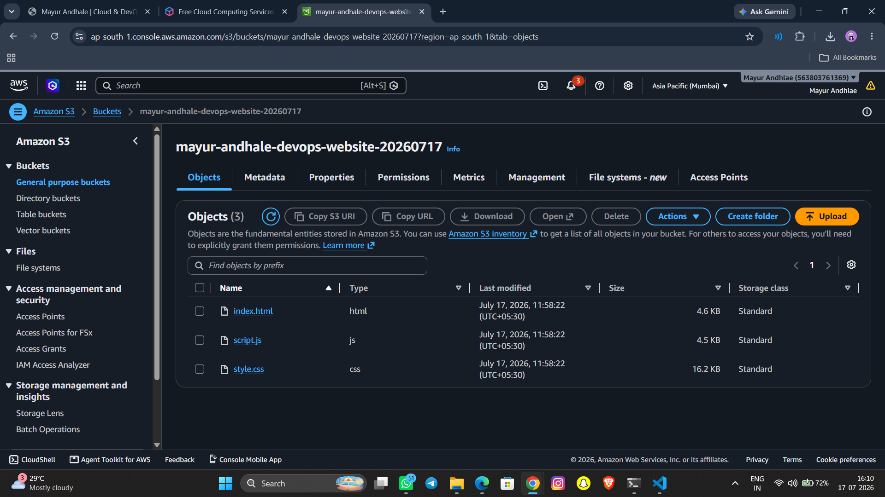
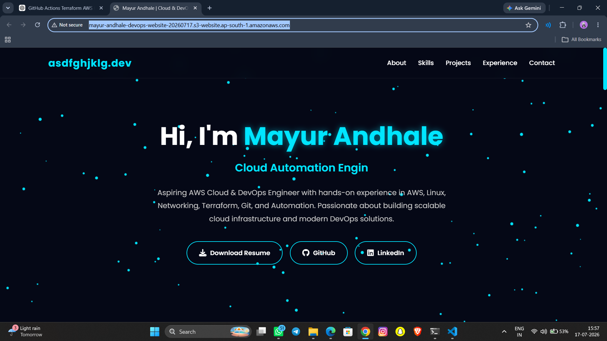

# 🚀 Automated Static Website Deployment using GitHub Actions, Terraform & AWS

End-to-End CI/CD Pipeline for deploying a static website on **Amazon S3** using **Terraform** and **GitHub Actions**.

---

# 🌐 Live Demo

**Website:**  
http://mayur-andhale-devops-website-20260717.s3-website.ap-south-1.amazonaws.com/

---

# 📌 Project Overview

This project demonstrates how to automate the deployment of a static website on AWS using **Infrastructure as Code (IaC)** with **Terraform** and **Continuous Integration/Continuous Deployment (CI/CD)** using **GitHub Actions**.

Whenever changes are pushed to the **main** branch, GitHub Actions automatically:

- ✅ Checks out the latest source code
- ✅ Configures AWS credentials securely using GitHub Secrets
- ✅ Initializes Terraform
- ✅ Validates Terraform configuration
- ✅ Creates an execution plan
- ✅ Applies infrastructure changes
- ✅ Deploys the updated website to Amazon S3

This project showcases modern DevOps practices and cloud automation using AWS.

---

# 🛠️ Technologies Used

- Git
- GitHub
- GitHub Actions
- Terraform
- AWS S3
- AWS IAM
- AWS CLI
- HTML5
- CSS3
- JavaScript
- VS Code

---

# 📁 Project Structure

```
Automated-Static-Website-Deployment-using-GitHub-Actions-Terraform-AWS/
│
├── .github/
│   └── workflows/
│       └── deploy.yml
│
├── terraform/
│   ├── provider.tf
│   ├── versions.tf
│   ├── variables.tf
│   ├── s3.tf
│   ├── website.tf
│   ├── outputs.tf
│   └── .terraform.lock.hcl
│
├── website/
│   ├── index.html
│   ├── style.css
│   └── script.js
│
├── .gitignore
└── README.md
```

---

# ⚙️ CI/CD Workflow

```
Developer
     │
     ▼
 Git Push
     │
     ▼
 GitHub Repository
     │
     ▼
 GitHub Actions
     │
     ├── Checkout Repository
     ├── Configure AWS Credentials
     ├── Terraform Init
     ├── Terraform Validate
     ├── Terraform Plan
     ├── Terraform Apply
     └── Deploy Website
     │
     ▼
 AWS S3 Static Website
```

---

# 🚀 Features

- Infrastructure as Code (Terraform)
- Automated CI/CD Pipeline
- Static Website Hosting on AWS S3
- GitHub Actions Automation
- Secure AWS Authentication using GitHub Secrets
- Automatic Deployment after every Git Push
- Version Controlled Infrastructure
- Easy to Maintain and Scale

---

# 📋 Prerequisites

Before running the project, install:

- Git
- Terraform
- AWS CLI
- Visual Studio Code
- AWS Account
- GitHub Account

---

# 🔑 GitHub Secrets

Configure the following GitHub Actions secrets:

| Secret Name | Description |
|-------------|-------------|
| AWS_ACCESS_KEY_ID | AWS Access Key |
| AWS_SECRET_ACCESS_KEY | AWS Secret Access Key |

Navigate to:

```
GitHub Repository
→ Settings
→ Secrets and Variables
→ Actions
```

---

# ▶️ Installation & Deployment

### Clone Repository

```bash
git clone https://github.com/Mayur0320/Automated-Static-Website-Deployment-using-GitHub-Actions-Terraform-AWS.git
```

### Navigate to Project

```bash
cd Automated-Static-Website-Deployment-using-GitHub-Actions-Terraform-AWS
```

### Initialize Terraform

```bash
cd terraform

terraform init
```

### Validate Configuration

```bash
terraform validate
```

### Preview Infrastructure

```bash
terraform plan
```

### Deploy Infrastructure

```bash
terraform apply
```

---

# 🔄 GitHub Actions Pipeline

Every push to the **main** branch automatically performs:

- Checkout Repository
- Configure AWS Credentials
- Terraform Init
- Terraform Validate
- Terraform Plan
- Terraform Apply
- Deploy Updated Website

---

# ☁️ AWS Resources

Terraform manages:

- Amazon S3 Bucket
- Static Website Hosting
- Bucket Policy
- Public Access Configuration
- Website Deployment

---

# 📷 Screenshots

Add screenshots of:

- GitHub Repository
- GitHub Actions Workflow
- Terraform Apply Output
- AWS S3 Bucket
- Live Website
# 📷 Project Screenshots

## GitHub Repository



---

## GitHub Actions Workflow



---

## Terraform Apply



---

## AWS S3 Bucket



---

## Live Website


---

# 💼 Skills Demonstrated

- DevOps
- Infrastructure as Code (IaC)
- Continuous Integration
- Continuous Deployment
- Git & GitHub
- GitHub Actions
- Terraform
- AWS S3
- AWS IAM
- AWS CLI
- Static Website Hosting
- Cloud Deployment
- Version Control
- Automation

---

# 🚀 Future Enhancements

- CloudFront CDN
- Route 53 Custom Domain
- HTTPS using ACM
- Remote Terraform Backend
- DynamoDB State Locking
- Terraform Modules
- Multi-Environment Deployment (Dev, QA, Prod)
- Monitoring with CloudWatch

---

# 👨‍💻 Author

## Mayur Andhale

- 🌐 **Live Website:**  
  http://mayur-andhale-devops-website-20260717.s3-website.ap-south-1.amazonaws.com/

- 💻 **GitHub:**  
  https://github.com/Mayur0320

- 🔗 **LinkedIn:**  
  https://linkedin.com/in/mayur-andhale-8b67b622b

